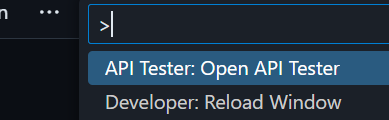
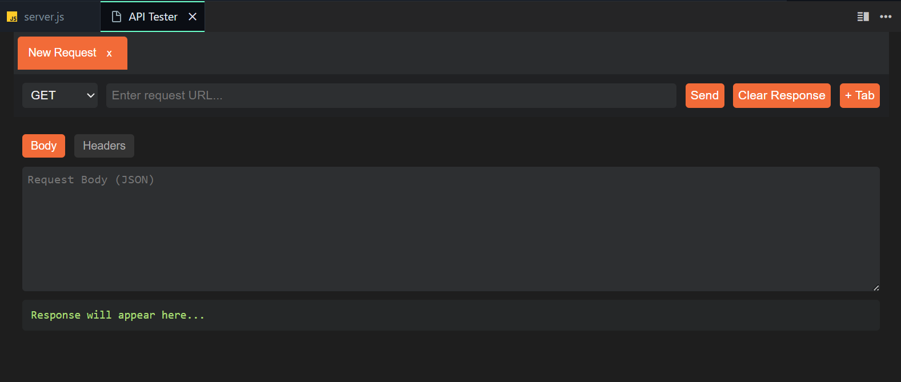

# API Tester Pro

**API Tester Pro** is a VS Code extension that helps developers monitor their repositories by showing:

- ✅ CI/CD build status
- 📂 Open Pull Requests
- 🕒 Pending Reviews

It also sends notifications when your build fails or when a PR review is added.

---

## Features

- View your repository’s health in a dashboard inside VS Code.
- Monitor CI/CD pipeline status.
- Keep track of open PRs and pending reviews.
- Get notifications for build failures or new PR reviews.

---

## Demo

Here’s a demo of the dashboard in action:

---

---

## Installation

1. Open VS Code.
2. Go to the **Extensions** view (`Ctrl+Shift+X` or `Cmd+Shift+X` on macOS).
3. Search for **Repo Health Assistant**.
4. Click **Install**.
